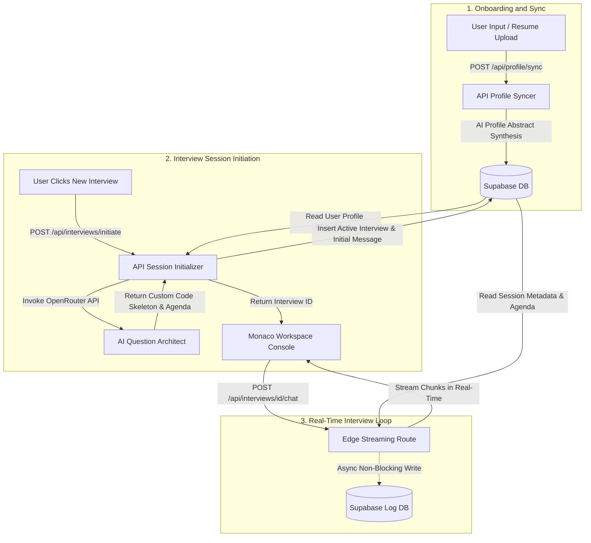
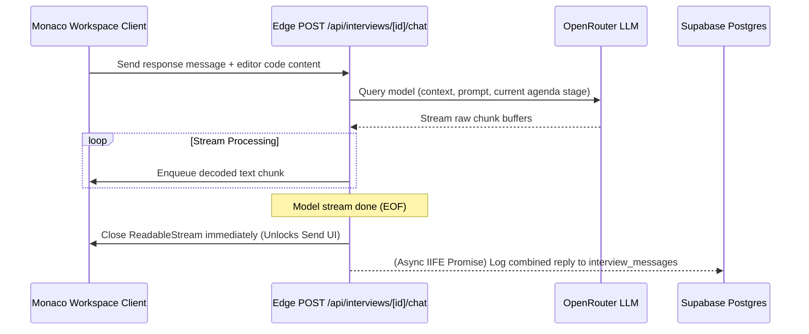

# Interview OS
> **AI Technical Mock Interview Platform**

Interview OS is an interactive mock interview platform designed to simulate realistic technical screening rounds with industry interviewers. Instead of generic templates or static question lists, Interview OS leverages candidate resumes, GitHub projects, and target roles to dynamically generate customized, deep-dive coding and design sessions in a Monaco editor workspace.

## Live Demo

The production environment is live at: [https://interview-os-brown.vercel.app](https://interview-os-brown.vercel.app)

---

## System Architecture

The following diagram illustrates the workflow of onboarding profile syncing, dynamic session initiation, and the real-time streaming loop:



### Edge Stream Workflow (Low-Latency Execution)

Interview OS utilizes a custom Edge runtime stream reader that decouples output processing from database logging. This eliminates client input lockups and guarantees immediate TCP connection closures:



---

## Core Features

*   **Four Specialized Mock Focus Tracks:**
    *   **Live PR Critique:** The AI inspects the candidate's target repository and generates a realistic pull request code review. The bug is customized by target role (e.g. SQL join aggregation logic for Data Analysts, React infinite loop re-renders for Frontend Developers, and async race conditions or leaks for Backend Developers/SDEs).
    *   **CS Fundamentals and System Design:** Covers structured theory across 3 distinct stages, specialized by role (e.g. Star/Snowflake modeling for Data Analysts, client state and caching for Frontend, concurrency/message queues for Backend/SDE).
    *   **DSA Sandbox (Multi-Problem Coding):** Simulates standard coding rounds by presenting 3 distinct, back-to-back coding challenges per session. The AI automatically advances the candidate to the next problem upon code correctness or successful complexity analysis.
    *   **Resume and Projects Grill:** A conversational interview focusing on the candidate's actual projects, architecture trade-offs, and technical achievements parsed directly from their uploaded resume, prompting one targeted question at a time.
*   **Targeted Role Alignment:** Tailor mock rounds to specialized industry positions:
    *   SDE (Software Development Engineer)
    *   Backend Developer
    *   Frontend Developer
    *   Data Analyst
*   **Automatic Session Retention Limit:** Enforces a maximum limit of 5 mock interviews per user. When creating a 6th session, the platform automatically purges the oldest session and all its cascading transcript messages from the database.
*   **Strict Calibrated Scorecard Evaluation:** Concluded sessions are analyzed using pre-computed participation metrics (word counts, response frequencies, code submission checks) against a strict scoring rubric, preventing AI score inflation and applying hard caps for zero or minimal participation.
*   **Interactive Monaco Sandbox:** Write, review, and refactor code directly inside a live code editor matching the target track and programming language (JavaScript, TypeScript, Python, C++, Java, Go, SQL).

---

## Tech Stack

*   **Framework:** Next.js 16 (App Router, Edge Runtime API Routes)
*   **Database:** Supabase (PostgreSQL client, `@supabase/ssr` server-side cookies, Row Level Security)
*   **Authentication:** Supabase Auth (Native email sign-in logic)
*   **AI Engine:** OpenRouter API (Gemini/Mistral Model Integration)
*   **Editor:** Monaco Code Editor (`@monaco-editor/react`)
*   **Styling:** Custom Glassmorphism, Dark UI, Framer Motion animations

---

## Getting Started

### 1. Prerequisites
Ensure you have Node.js installed on your machine.

### 2. Database Schema Setup
Execute the DDL schema inside `supabase/schema.sql` in your Supabase SQL Editor. This sets up the target tables (`users`, `user_profiles`, `interviews`, `interview_messages`) and configures Row Level Security (RLS).

### 3. Environment Variables Configuration
Create a `.env.local` file in the root directory and configure the following variables:
```env
NEXT_PUBLIC_SUPABASE_URL=your-supabase-url
NEXT_PUBLIC_SUPABASE_ANON_KEY=your-supabase-anon-key
SUPABASE_SERVICE_ROLE_KEY=your-supabase-service-key
OPENROUTER_API_KEY=your-openrouter-api-key
```

### 4. Running Locally
Install the dependencies and start the local development server:
```bash
npm install
npm run dev
```
Open [http://localhost:3000](http://localhost:3000) to view the application.

---

## License
This project is licensed under the MIT License.
