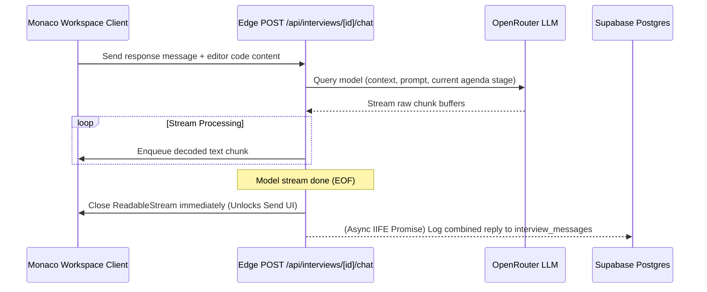

# Interview OS

**AI Technical Mock Interview Platform**

Interview OS is an interactive mock interview platform designed to simulate realistic technical screening rounds with industry interviewers. Instead of generic templates or static question lists, Interview OS leverages candidate resumes, GitHub projects, and target roles to dynamically generate customized, deep-dive coding, design, and behavioral sessions inside a Monaco editor workspace.

## Live Demo

The production environment is live at: [https://interview-os-brown.vercel.app](https://interview-os-brown.vercel.app)

---

## System Architecture

The following diagram illustrates the full workflow from onboarding and profile syncing, through dynamic session initiation, and into the real-time streaming interview loop:


### Edge Stream Workflow (Low-Latency Execution)

Interview OS uses a custom Edge runtime stream reader that decouples output processing from database logging. This eliminates client input lockups and guarantees immediate TCP connection closures after the model stream terminates:



---

## Core Features

### Mock Interview Tracks

Interview OS provides five specialized mock interview tracks, each targeting a distinct interview format and evaluation dimension:

**Live PR Critique**

The AI inspects the candidate's linked GitHub repository and generates a realistic pull request code review session. The flaw embedded in the code snippet is customized by target role:

- Data Analysts: SQL join aggregation errors, Cartesian product bugs, or vectorization gaps in Pandas pipelines.
- Frontend Developers: React stale closures, infinite re-render loops caused by unmemoized dependencies, or missing cleanup inside subscription callbacks.
- Backend Developers / SDEs: Async race conditions, thread-safety violations, SQL injection gaps, or memory leaks in loop constructs.

The session follows three stages: Flaw Identification, Refactoring, and Prevention (engineering culture discussion on how to prevent the bug class from reaching production).

---

**CS Fundamentals and System Design**

Covers structured theory and implementation across three distinct stages, specialized by role:

- Data Analysts: Relational schema design, Star vs Snowflake data warehouse modeling, and ETL/ELT pipeline architecture.
- Frontend Developers: Component architecture and state management, browser performance optimization (SSR vs CSR vs ISR), and client-side security (XSS, CSRF, WebSocket vs HTTP polling).
- Backend Developers / SDEs: Low-level class design and OOP principles, system component deep-dives (caching, queuing, database indexing), and distributed systems trade-offs (CAP theorem, consistency models, horizontal vs vertical scaling).

---

**DSA Sandbox (Multi-Problem Coding)**

Simulates a standard algorithmic coding round by presenting three distinct, back-to-back coding challenges per session. Each problem is introduced naturally by the AI interviewer persona. The AI automatically advances the candidate to the next problem when the current problem is solved correctly or the candidate has articulated a valid optimal complexity analysis.

Data Analyst candidates receive SQL and Pandas-focused problems (window functions, CTEs, data aggregations) instead of standard algorithm problems.

---

**Resume and Projects Grill**

A conversational HR plus technical interview focused on the candidate's actual projects, architecture trade-offs, and technical achievements derived from their uploaded resume. The AI follows a five-stage progression: project walkthrough, technical deep-dive, challenges and debugging, scale and production readiness, and behavioral close. Only one targeted question is posed per response turn to simulate a real interviewer cadence.

---

**Behavioral and HR Round**

A fully conversational behavioral interview evaluated using the STAR methodology (Situation, Task, Action, Result). The AI interviewer persona is drawn from a configurable difficulty-matched recruiter profile (e.g., HR Lead, Senior Talent Manager, Google People Operations Lead, Amazon Principal Bar Raiser). Sessions follow a five-stage progression:

1. STAR Framework Introduction: Candidate self-introduction and an opening story about a major project bottleneck or deadline pressure.
2. Conflict Resolution: Handling disagreements with teammates, tech leads, or product managers.
3. Ambiguity and Adaptability: Responding to changing specifications, undefined requirements, or shifting project scope.
4. Ownership and Initiative: Demonstrating extreme ownership, mentoring others, and taking initiative beyond the defined role.
5. Vision and Compensation: Career trajectory, alignment with company culture, and realistic salary negotiation.

Generic or boilerplate answers are challenged directly. The interviewer follows each answer with a targeted follow-up to verify specificity and actual individual contribution.

---

### Additional Platform Features

**Role-Targeted Customization**

Mock sessions are tailored to the following specialized industry positions:

- SDE (Software Development Engineer)
- Backend Developer
- Frontend Developer
- Data Analyst

**Automatic Session Retention Limit**

Enforces a maximum of 5 mock interviews per user. When a 6th session is created, the platform automatically purges the oldest session and all its cascading transcript messages from the database.

**Calibrated Scorecard Evaluation**

Concluded sessions are analyzed using pre-computed participation metrics (word counts, response frequencies, code submission detection) against a strict scoring rubric. Hard score caps are applied for zero or minimal participation, preventing AI score inflation. A weighted average across technical, problem-solving, and communication sub-scores is enforced server-side as a safety net against non-compliant LLM scoring.

**Personalized Study Roadmap**

After session conclusion, a targeted study roadmap of 3 to 5 items is generated. Each item directly addresses a specific gap observed in that session and links to a real authoritative resource (MDN, LeetCode editorials, PostgreSQL docs, GeeksforGeeks, CS50, etc.). Generic advice is explicitly excluded.

**AI Code Compiler Sandbox**

Candidates can execute their code directly inside the platform. The AI compiler sandbox simulates compilation, syntax checking, runtime execution, and test case assertions across all supported languages. It does not require a main function wrapper.

**Interactive Monaco Editor**

Write, review, and refactor code inside a live editor with language support for JavaScript, TypeScript, Python, C++, Java, Go, and SQL.

---

## Tech Stack

| Layer | Technology |
|---|---|
| Framework | Next.js 16 (App Router, Edge Runtime API Routes) |
| Database | Supabase (PostgreSQL, Row Level Security) |
| Authentication | Supabase Auth (email sign-in) |
| AI Engine | OpenRouter API (Gemini / Mistral model integration) |
| Editor | Monaco Code Editor (`@monaco-editor/react`) |
| Animations | Framer Motion |
| Styling | Custom Glassmorphism, Dark UI |

---

## API Reference

The platform exposes a REST API documented in the included Postman collection ([AI Interviewer API.postman_collection.json](./AI%20Interviewer%20API.postman_collection.json)).

| Method | Endpoint | Description |
|---|---|---|
| POST | `/api/profile/sync` | Sync candidate role, difficulty, resume, and GitHub repos to Supabase |
| POST | `/api/interviews/initiate` | Create a new interview session and generate the opening question |
| POST | `/api/interviews/:id/chat` | Submit a candidate message and receive a streamed AI interviewer reply |
| POST | `/api/interviews/:id/run` | Execute candidate code in the AI compiler sandbox |
| POST | `/api/interviews/:id/hint` | Request a targeted conceptual hint without receiving the answer |
| POST | `/api/interviews/:id/conclude` | Finalize the session and generate scorecard plus study roadmap |

All endpoints require a valid Supabase session cookie. See the Postman collection for full request schema and example payloads.

---

## Getting Started

### 1. Prerequisites

Ensure Node.js is installed on your machine.

### 2. Database Schema Setup

Execute the DDL schema inside `supabase/schema.sql` in your Supabase SQL Editor. This creates the required tables (`users`, `user_profiles`, `interviews`, `interview_messages`) and configures Row Level Security policies.

### 3. Environment Variables

Create a `.env.local` file in the project root and configure the following variables:

```env
NEXT_PUBLIC_SUPABASE_URL=your-supabase-url
NEXT_PUBLIC_SUPABASE_ANON_KEY=your-supabase-anon-key
SUPABASE_SERVICE_ROLE_KEY=your-supabase-service-key
OPENROUTER_API_KEY=your-openrouter-api-key
```

### 4. Run Locally

```bash
npm install
npm run dev
```

Open [http://localhost:3000](http://localhost:3000) in your browser.

---

## License

This project is licensed under the MIT License.
