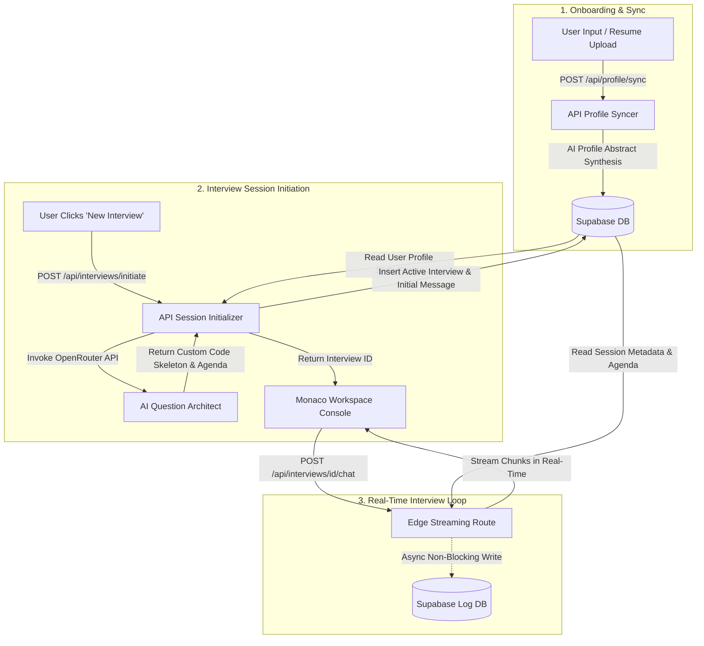
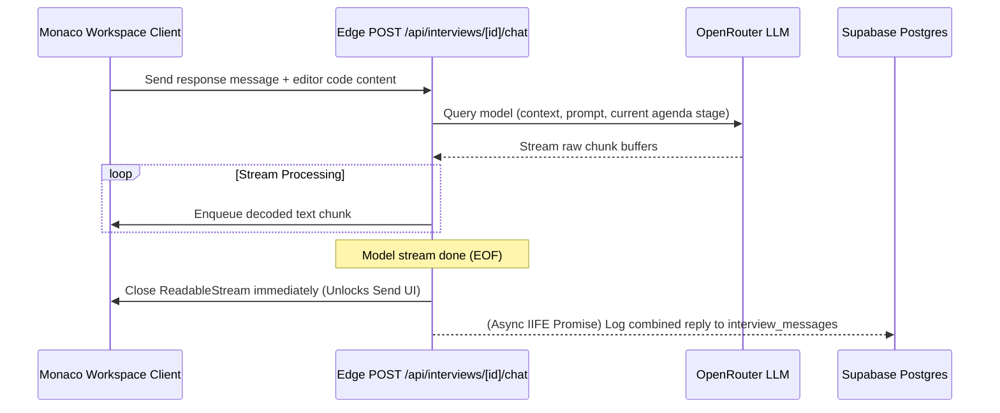

# Interview OS 🚀
> **The Dynamic AI Technical Mock Interview Platform**

Interview OS is an interactive mock interview platform designed to simulate realistic technical screening rounds with Principal/Senior Software Engineers. Instead of generic quiz templates or static LeetCode lists, Interview OS leverages your resume, GitHub projects, and target role to dynamically generate customized, deep-dive grilling coding sessions in Monaco.

---

## 🏗️ System Architecture

The following diagram illustrates the workflow of the onboarding profile syncing, dynamic session initiation, and real-time streaming loop:



### Edge Stream Workflow (Low-Latency Execution)

Interview OS utilizes a custom Edge runtime stream reader that decouples output processing from database logging. This eliminates client input lockups and guarantees immediate TCP pipeline closures:



---

## 🌟 Key Features

*   **Four Comprehensive Mock Focus Tracks:**
    *   **Live PR Critique:** The AI reads your tech stack, generates a realistic buggy codebase (e.g. Go channels race condition, Python thread locks, JS event loops) and acts as a code reviewer.
    *   **CS Fundamentals & System Design:** Focuses on low-level class design (OOP), cache replacement logic (LRU), network sockets (TCP/UDP), and OS threads.
    *   **General DSA Sandbox:** Practice classic algorithms formatted in your target language.
    *   **Resume & Projects Grill:** Tailored specifically to ask questions about projects and tech stacks parsed from your uploaded resume.
*   **Dynamic Agenda Tracker:** Guides candidates through distinct phases (Conceptual Walkthrough -> Coding -> Edge Cases & Review) in real time.
*   **Interactive Monaco Sandbox:** Write and refactor code directly inside a live code editor matching your target track.
*   **Seamless Supabase Integration:** Secure database logging, row-level security (RLS) policies, and profile syncs.

---

## 🛠️ Tech Stack

*   **Framework:** Next.js 16 (App Router, Edge Runtime API Routes)
*   **Database:** Supabase (PostgreSQL client, `@supabase/ssr` server-side cookies, Row Level Security)
*   **Authentication:** Supabase Auth
*   **AI Engine:** OpenRouter API (Gemini/Mistral Model Integration)
*   **Editor:** Monaco Code Editor (`@monaco-editor/react`)
*   **Styling:** Custom Glassmorphism, Dark UI, Framer Motion animations

---

## 🚀 Getting Started

### 1. Prerequisites
Ensure you have [Node.js](https://nodejs.org/) installed on your machine.

### 2. Database Schema Setup
Execute the DDL schema inside [supabase/schema.sql](file:///d:/AI%20Interviewer/supabase/schema.sql) in your Supabase SQL Editor. This sets up the target tables (`users`, `user_profiles`, `interviews`, `interview_messages`) and configures Row Level Security (RLS).

### 3. Environment Variables Configuration
Create a `.env.local` file in the root directory and configure the following variables:
```env
NEXT_PUBLIC_SUPABASE_URL=your-supabase-url
NEXT_PUBLIC_SUPABASE_ANON_KEY=your-supabase-anon-key
SUPABASE_SERVICE_ROLE_KEY=your-supabase-service-key
OPENROUTER_API_KEY=your-openrouter-api-key
```

### 4. Running Locally
Install the dependencies and start the local development server:
```bash
npm install
npm run dev
```
Open [http://localhost:3000](http://localhost:3000) to view the application.

---

## 📄 License
This project is licensed under the MIT License.
